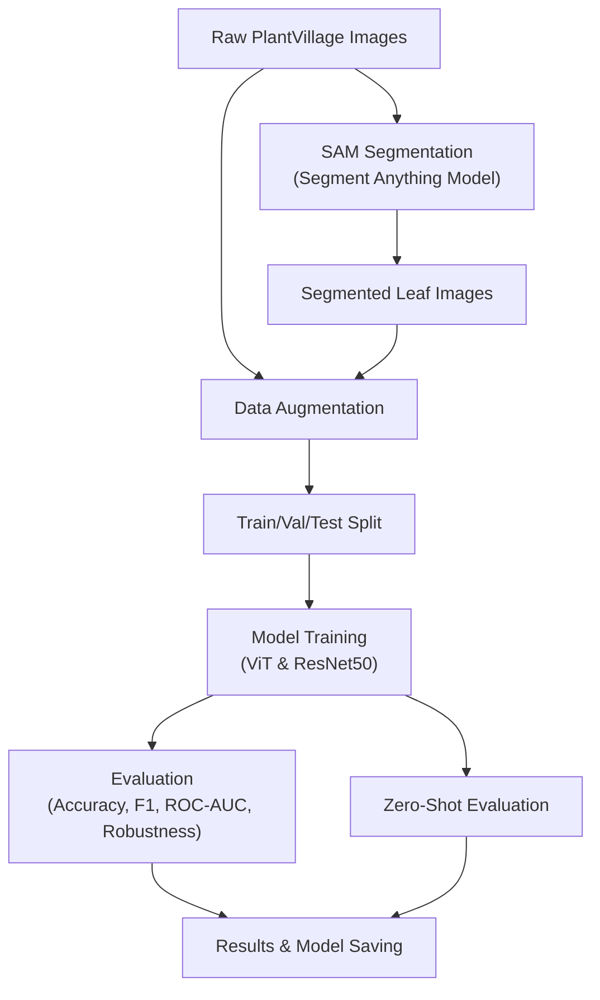
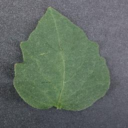
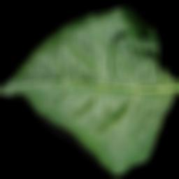

# Plant Leaf Disease Classification with SAM, ViT, and ResNet

This repository provides a robust, modular pipeline for plant leaf disease detection using state-of-the-art deep learning and segmentation models. It combines the Segment Anything Model (SAM) for precise leaf segmentation with Vision Transformer (ViT) and ResNet50 for accurate disease classification.

---

## Project Overview

This project demonstrates a professional, reproducible workflow for plant disease classification, suitable for both research and real-world deployment. The pipeline includes:

1. **Data Preparation:** Organize and preprocess the PlantVillage dataset.
2. **Segmentation:** Use the Segment Anything Model (SAM) to isolate leaves and remove background noise.
3. **Data Augmentation:** Apply robust augmentations (rotations, flips, Gaussian blur) to improve model generalization.
4. **Model Training:** Fine-tune both ViT and ResNet50 on:
   - The original dataset (first round)
   - The SAM-segmented dataset (second round, with test set matching)
5. **Evaluation:** Comprehensive metrics (accuracy, F1, precision, recall, ROC-AUC) and robustness testing under noise.
6. **Zero-Shot Evaluation:** Assess model generalization to unseen classes or conditions.
7. **Reproducibility:** All configs, splits, and results are controlled via `config.py` for easy experiment tracking.

---

### Pipeline Flowchart



---

## Example Images

Below are example images from the pipeline:

- **Original Image:** Example from the PlantVillage dataset before segmentation.
- **Segmented Image:** The same (or similar) leaf after background removal using SAM.

| Original Image                                   | Segmented Image                                    |
|--------------------------------------------------|----------------------------------------------------|
|  |  |

These illustrate the transformation from raw data to clean, model-ready input.

---

## Pipeline Details

### 1. Data Preparation
- Organize PlantVillage images by class.
- Preprocessing scripts handle label mapping, train/val/test splits, and ensure test set consistency across rounds.

### 2. Segmentation (SAM)
- The Segment Anything Model (SAM) segments each image, producing a clean, leaf-only dataset.
- Segmented images are stored separately for second-round training.

### 3. Data Augmentation
- Augmentations include random rotations, flips, and Gaussian blur.
- Augmentation is applied consistently to both original and segmented datasets.

### 4. Model Training
- **ViT and ResNet50** are both supported.
- Training is performed in two rounds:
  - **First round:** On original images.
  - **Second round:** On SAM-segmented images, with test set matching for fair comparison.
- All model and processor configs are saved for reproducibility.

### 5. Evaluation
- Reports accuracy, F1-score, precision, recall, ROC-AUC.
- Includes robustness evaluation under added noise.

### 6. Zero-Shot Evaluation
- Evaluate model performance on unseen classes or conditions, demonstrating generalization.

---

## Legacy Scripts

The following scripts are retained from the original codebase for reference:
- `1st_training.py`: First-round training on original images.
- `2nd_training.py`: Second-round training on SAM-segmented images.
- `zero_shot.py`: Zero-shot evaluation logic.

Their logic has now been fully integrated into the modular pipeline (`main.py`, `train.py`, `evaluate.py`, etc.), but they are provided for transparency and reproducibility.

---

## Quick Start

1. **Install dependencies**
   ```bash
   pip install -r requirements.txt
   ```

2. **Prepare data**
   - Place your PlantVillage dataset under `data/plant_village/`, organized into class subfolders.

3. **Run the pipeline**
   ```bash
   python main.py
   ```

4. **Configuration**
   - Edit `config.py` to adjust:
     - Paths (`DATA_DIR`, `SAM_OUTPUT_DIR`)
     - Hyperparameters (`BATCH_SIZE`, `IMG_SIZE`, `LR`, `EPOCHS`)
     - Model selection and experiment settings

---

## Reproducibility

- All experiments are controlled via `config.py`.
- Random seeds are set for deterministic splits and training.
- Model weights, processor configs, and results are saved for each run.

---

## Authors

- **Rongyi Shen** ([rongyish@usc.edu](mailto:rongyish@usc.edu))
- **Xiao Bai** ([xiaobai@usc.edu](mailto:xiaobai@usc.edu))
- **Wenjing Huang** ([whuang08@usc.edu](mailto:whuang08@usc.edu))

---

## License

This project is licensed under the MIT License - see the [LICENSE](LICENSE) file for details.

---

## Acknowledgments

- The PlantVillage dataset and the open-source community for providing valuable resources.
- The developers of [Segment Anything Model (SAM)](https://github.com/facebookresearch/segment-anything), [HuggingFace Transformers](https://huggingface.co/docs/transformers/index), and [PyTorch](https://pytorch.org/).
- Inspiration from recent advances in computer vision and plant pathology research.

---

## Support

For questions or support, please contact the authors via the emails above or create an issue in the repository. 